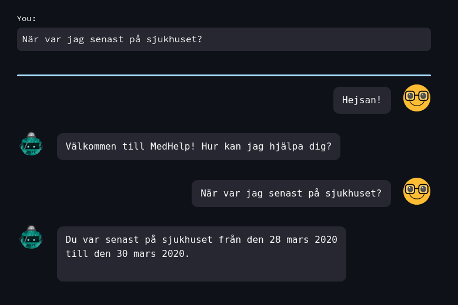
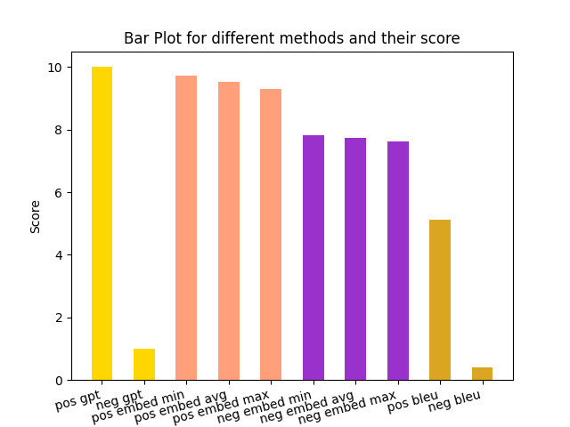

<h1 style="text-align: center;">MedHelp</h1>





MedHelp is a chatbot designed to assist medical staff and patients in finding medical information which for example are stored in journals or calendars.

It was made in python using GPT-3.5 Turbo & Streamlit.

This is one of three projects produced as of AI Swedens "GPT Summer Internship" for the summer of 2023, and was a collaboration between AI Sweden and Sahlgrenska University Hospital in Gothenburg.

MedHelp is designed primarily with swedish in mind.

- [Description](#description)
- [Getting Started](#getting-started)
  - [Dependencies](#dependencies)
  - [Executing program](#executing-program)
- [Testing](#testing)
- [Authors:](#authors)
- [Acknowledgments](#acknowledgments)


## Description

MedHelp is designed with two users in mind:

* Medical Staff: doctors, nurses
* Non Medical Staff: patients, caretakers of patients
  
Currently these come in the form of just doctors and patients, with the difference being that a patient has access to a single directory of documents, their own, whereas doctors can access a list of patients documents.

Documents are of imaginary patients since in practice these are very sensitive and for legal reasons cannot "leave" the hospital.
They were however made to be similar in structure to real documents, with guidance from data scientists working in the field.

Upon prompting, MedHelp will check if the user is a doctor or patient, and depending on the query will pick suitable documents as background (using embeddings and similarity scoring) to produce a high quality answer. This is done via a web interface in the form of a simple chat.

## Getting Started

### Dependencies

* You need to store your API key to OpenAI under the environment variable ```OPENAI_API_KEY ```.
* You need to have streamlit installed to run the web interface
* Possibly need to install some miscellaneous libraries python libaries like ```pandas```, ```PyPDF2``` or ```SciPy```

### Executing program

To run the web interface, first make sure that your terminal is positioned in the gpt-internship directory, for example by running:
```
cd some/path/gpt-internship
```
Next, run the following streamlit command:
```
streamlit run Project_assistant/streamlit_app.py
```
Please note that if you restart the interface, you need to close down your previous tab/tabs that were running it or this will produce some errors.


## Testing
Testing applications that use LLMs can be difficult, and we are in the process of trying out different metrics and test cases to see what gives the best results.
Currently, there is only a small handcrafted dataset consisting of queries made by our different fictional doctors, and reference responses that MedHelp should match.
We check the likeness between these reference responses and the candidate response generated during the test. The candidate responses are generated in two ways:

* Without access to background information to check that MedHelp does not hallucinate a fictious answer. It should basically answer "I don't know".
* With access, to see that the information is used and the likeness it high.

This is done with the following metrics, and the latest scores are presented bellow:
* Cosine Similarity, using embedded versions of reference and candidate answers
* [BLEU score](https://en.wikipedia.org/wiki/BLEU)
* GPT Testing: We prompt GPT to itself judge whether the generated candidate answer provides the same information as the reference answers.




## Authors:
[Henrik Johansson](https://github.com/henkejson)

[Oskar Pauli](https://github.com/OGPauli)

[Felix Nilsson](https://github.com/Felix-Nilsson)


## Acknowledgments

We would like to thank Isak Barbopoulos at Sahlgrenska for supervising this project and providing guidance.