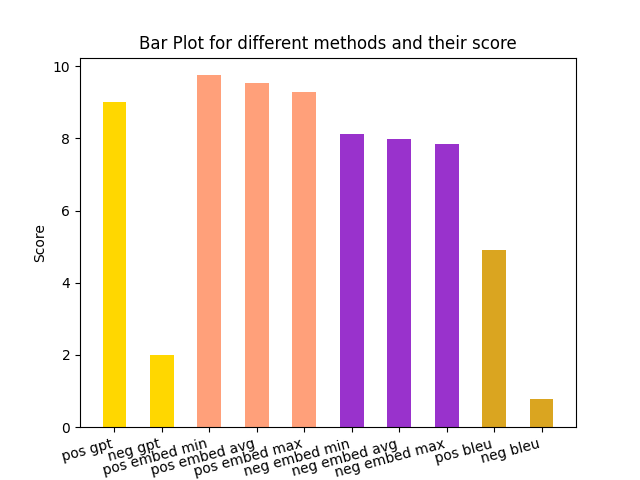
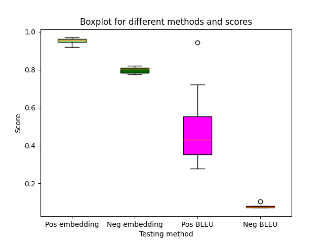

<h1 align= center>Sahlgrenska AI Hjälp</h1>


<p align="center">
  
</p>

<p align="center">


</p>


Sahlgrenska AI Hjälp is a set of chatbots designed to assist medical staff and patients in finding medical information which for example are stored in journals or calendars, or in administrative documents or even on the internet. They are all accessed through a single web interface.

The backend is made in python and flask, using GPT-3.5 Turbo and text-embedding-ada-002 from the OpenAI API.
The Frontend is made with SvelteKit.

This is one of three projects produced as part of AI Swedens "GPT Summer Internship" for the summer of 2023, and was a collaboration between AI Sweden and Sahlgrenska University Hospital in Gothenburg.

Sahlgrenska AI Hjälp is designed primarily with swedish in mind.

🔗 [Link to blog]( https://my.ai.se/projects/287)

<p align="center">
  
</p>


## 📚 Table of Contents 
- [📚 Table of Contents](#table-of-contents)
- [📋 Description](#-description)
- [🚀 Getting Started](#-getting-started)
  - [Dependencies](#dependencies)
  - [Initializing the Database](#initializing-the-database)
  - [Executing program](#executing-program)
- [🧪 Testing](#-testing)
- [✍️ Authors](#️-authors)
- [🤝 Acknowledgments](#-acknowledgments)


## 📋 Description

Sahlgrenska AI Hjälp is designed with two users in mind:

* Medical Staff: doctors, nurses
* Patients, caretakers of patients
* Anonymous Users
  
Currently these come in the form of just doctors and patients, with the difference being that a patient has access to a single directory of documents, their own, whereas doctors can access a list of patients documents. In addition to this doctors can use a chatbot which has access administrative documents, like contact information and roles within different departments.

The anonymous users can access a single chatbot, designed to take general health questions and find information on selected websites using agents from LangChain.

---

Documents are of imaginary patients and doctors since in practice these are very sensitive and for legal reasons cannot "leave" the hospital.
They were however made to be similar in structure to real documents, with guidance from professionals working in the field.


## 🚀 Getting Started

### Dependencies

* You need to store your API key to OpenAI under the environment variable ```OPENAI_API_KEY```.
  
* To run the web interface, you need to install ```npm``` and run the ```npm install``` command in the directory ```gpt-internship/svelte/my-app```.
  
* To run the server backend, you need to install ```flask``` as well as ```flask-cors``` and ```bcrypt```.

* Possibly need to install some miscellaneous libraries python libaries like ```pandas```, ```PyPDF2``` or ```SciPy```.

### Initializing the Database
The project uses a vector database from [Chroma](https://docs.trychroma.com/) for efficient document retrieval. If you are running the project for the first time you need to initialize it and can do so with the following command from the ```gpt-internship``` directory.

```
python3 -c "from db.chroma import make_db_docs as d; d()"; 
python3 -c "from db.chroma import make_db_patients as d; d()";
python3 -c "from db.chroma import print_db_summary as d; d()"
```
If the commands executed correctly, the summary should state that the database is ~3 MB
(Since the database is persistent, this only needs to be done once or if the documents are updated)
### Executing program

(The order of running the front/backend should not matter)

-> Open two terminals, one for the backend and one for the frontend

To run the backend,
- `cd gpt-internship/svelte`
- `python server.py`


To run the frontend,
- `cd gpt-internship/svelte/my-app`
- `npm install`
- `npm run dev -- --open` (Run the Svelte app)

    (`--open` opens the page in the browser automatically and can be ommitted.)

Note:
- The frontend should run on localhost:5000 and the backend on localhost:5001.


## 🧪 Testing
Testing applications that use LLMs can be difficult, and we are in the process of trying out different metrics and test cases to see what gives the best results.
Currently, there is only a small handcrafted dataset consisting of queries made by our different fictional doctors, and reference responses that Sahlgrenska AI Hjälp should match.
We check the likeness between these reference responses and the candidate response generated during the test. The candidate responses are generated in two ways:

* Negative: Without access to background information, this is to check that Sahlgrenska AI Hjälp does not hallucinate a fictious answer. It should basically answer "I don't know".
* Positive: With access, to see that the information is used and the likeness it high.

This is done with the following metrics, and the latest scores are presented bellow:
* [Cosine Similarity](https://en.wikipedia.org/wiki/Cosine_similarity), using [embedded](https://platform.openai.com/docs/guides/embeddings/what-are-embeddings) versions of reference and candidate answers
* [BLEU score](https://en.wikipedia.org/wiki/BLEU)
* GPT Testing: We prompt GPT to itself judge whether the generated candidate answer provides the same information as the reference answers.

<p align="center">
  
</p>


In particular, the BLEU scoring and Embedded Similarity are most similar since for any test $x$ we have $x \in [0,1]$, whereas GPT tests have $x \in \{0,1\}$. With this in mind we present the variance in the tests:

<p align="center">
  
</p>

To run the tests for yourself run the following python script with the same positioning of the terminal as before:
```
python3 Project_assistant/tests/test.py
```
To run individiual tests or disable generation of plots, please edit the file ```test.py``` accordingly.

Resulting data and plots are stored in the directories ```tests/results/data``` & ```tests/results/plots```.


## ✍️ Authors
[Henrik Johansson](https://github.com/henkejson)

[Oskar Pauli](https://github.com/OGPauli)

[Felix Nilsson](https://github.com/Felix-Nilsson)


## 🤝 Acknowledgments

We would like to thank Isak Barbopoulos at Sahlgrenska for supervising this project and providing guidance.