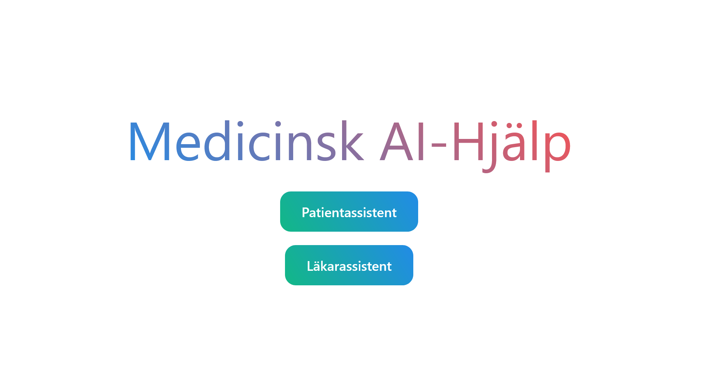

<h1 align= center>Medicinsk AI-Hjälp</h1>

<p align="center">
  
</p>

<p align="center">


</p>

Medicinsk AI-Hjälp is a set of chatbots designed to assist medical staff and patients in finding medical information that is stored in for example journals, calendars, administrative documents, or even on the internet. They are all accessed through a single web interface.

The backend is made with Python and flask, using GPT-3.5 Turbo/GPT-4 and text-embedding-ada-002 from the OpenAI API.
The frontend is made with SvelteKit.

This is one of three projects produced as part of AI Sweden's "GPT Summer Internship" for the summer of 2023, and was a collaboration between AI Sweden and VGR (Sahlgrenska University Hospital) in Gothenburg. It serves as a proof of concept for using LLMs in a healthcare context.

Medicinsk AI-Hjälp is designed primarily with Swedish in mind.

🔗 [Link to blog](https://my.ai.se/projects/287)

### ⚖️ Guidelines

As part of this project we were also tasked with writing a set of guidelines (in Swedish). [Read them here](img/gpt_internship_guidelines.pdf)

### 🔍 Preview

<p align="center">
  
</p>


## 📚 Table of Contents

- [📚 Table of Contents](#-table-of-contents)
- [📋 Description](#-description)
- [🚀 Getting Started](#-getting-started)
  - [Dependencies](#dependencies)
  - [Initializing the Database](#initializing-the-database)
  - [Executing the programs](#executing-the-programs)
- [🧪 Testing](#-testing)
- [✍️ Authors](#️-authors)
- [🤝 Acknowledgments](#-acknowledgments)


## 📋 Description

Medicinsk AI-Hjälp is designed with two users in mind:

* Medical staff: doctors, nurses, etc
* Patients, caretakers of patients

Both kinds of users are required to login to use the service.
When logged in they can access some of the available chatbots, depending on their role. Medical staff (mainly focused towards doctors at this time) can access the following chatbots:

- "Doctor's assistant", which can help them find information about specific patients.
- "Intranet assistant", which can help them find such information as contact information, etc., that exists on an intranet.
- "Internet assistant", which can help them find information about diseases, injuries or medicines from trusted sources, such as [1177.se](https://www.1177.se), [FASS.se](https://www.fass.se) and [Internetmedicin.se](https://internetmedicin.se).

Patients can access the following chatbots:

- "Patient's assistant", similar to the "Doctor's assistant" with the only difference being that patients can only access their own medical records.
- "Internet assistant", the same as for medical staff.

---

Documents are of imaginary patients and doctors since in practice these are very sensitive and for legal reasons cannot "leave" the hospital.
They were however made to be similar in structure to real documents, with guidance from professionals working in the field.

This application is an example of **retrieval augmentented generation** or RAG, which is a general pattern of LLM applications that fetch information to use in the prompt.

[Link to article on RAG on Pinecone](https://www.pinecone.io/learn/retrieval-augmented-generation/)

## 🚀 Getting Started


### Dependencies

* You need to store your API key to OpenAI under the environment variable ```OPENAI_API_KEY```.

* To run the web interface, you need to install ```npm``` and ```node```. If you don't already have these you can download them in the following way:

   First install ```nvm```, the **node version manager** for example in the following way:

  ```curl -o- https://raw.githubusercontent.com/nvm-sh/nvm/master/install.sh | bash```

   Please restart your terminal, and to make sure that it is installed properly check for example the version:

  ```nvm --version```

   Finally install ```node```:

  ```nvm install node```

  You can verify that it worked by running:

  ```node --version```

  ```npm --version```

* To install the Python packages, please run ```pip install -r requirements.txt``` in the directory ```gpt-internship/```


### Initializing the Database

The project uses a vector database from [Chroma](https://docs.trychroma.com/) for efficient document retrieval. If you are running the project for the first time you need to initialize it and can do so with the following commands from the ```gpt-internship``` directory.

```
python3 -c "from db.chroma import make_db_docs as d; d()";
python3 -c "from db.chroma import make_db_patients as d; d()";
python3 -c "from db.chroma import print_db_summary as d; d()";
```

If the commands executed correctly, the summary should state that the database is ~3 MB. (Since the database is persistent, this only needs to be done once or if the documents are updated.)


### Executing the programs

(The order of running the front/backend should not matter.)

Open two terminals, one for the backend and one for the frontend

To run the backend:

```
cd gpt-internship/svelte
python server.py
```

To run the frontend:

```
cd gpt-internship/svelte/my-app
npm install
npm run dev -- --open
```

(`npm run dev` runs the Svelte app and `--open` opens the page in the browser automatically which can be omitted.)

Note:

- The frontend should run on localhost:5000 and the backend on localhost:5001.


## 🧪 Testing

Recently, we swapped from a locally developed test suite to [promptfoo](https://promptfoo.dev/docs/intro/), an open source solution to systematically test prompts. It makes prompt testing easily accessible through a web interface and offers for example integration with git actions, which we intend to explore more at a later state.

<p align="center">
  
</p>

To run testing with promptfoo:

```
cd gpt-internship/promptfoo
npx promptfoo eval
```

And if you want to access the tests through the web interface, also run:

```
npx promptfoo view
```

The tests are currently designed to test the quality of answers, not the **retrieval**, and as such the test cases are already supplied with the best chunk as background information.
It may be interesting to test both retrieval and answer quality, but since retrieval is currently handled by our Chroma database we elected to focus on the testing of the prompts.

The details of each test can be found in the file `gpt-internship/promptfoo/promptfooconfig.yaml`. Currently whether a test passes is determined by `llm-rubric` which means that a separate LLM instance will observe some condition and pass judgement whether the condition was fulfilled.


## ✍️ Authors

[Henrik Johansson](https://github.com/henkejson)

[Oskar Pauli](https://github.com/OGPauli)

[Felix Nilsson](https://github.com/Felix-Nilsson)


## 🤝 Acknowledgments

We would like to thank Isak Barbopoulos at Sahlgrenska for supervising this project and providing guidance.
