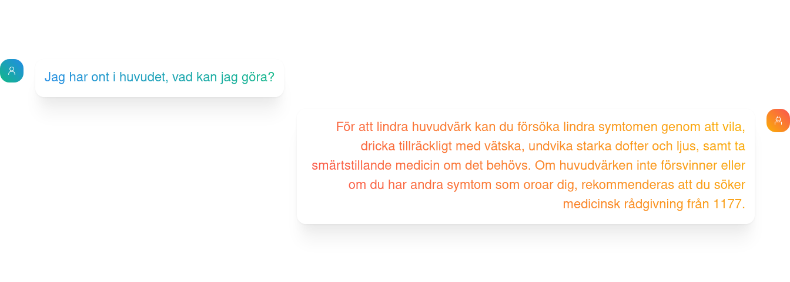
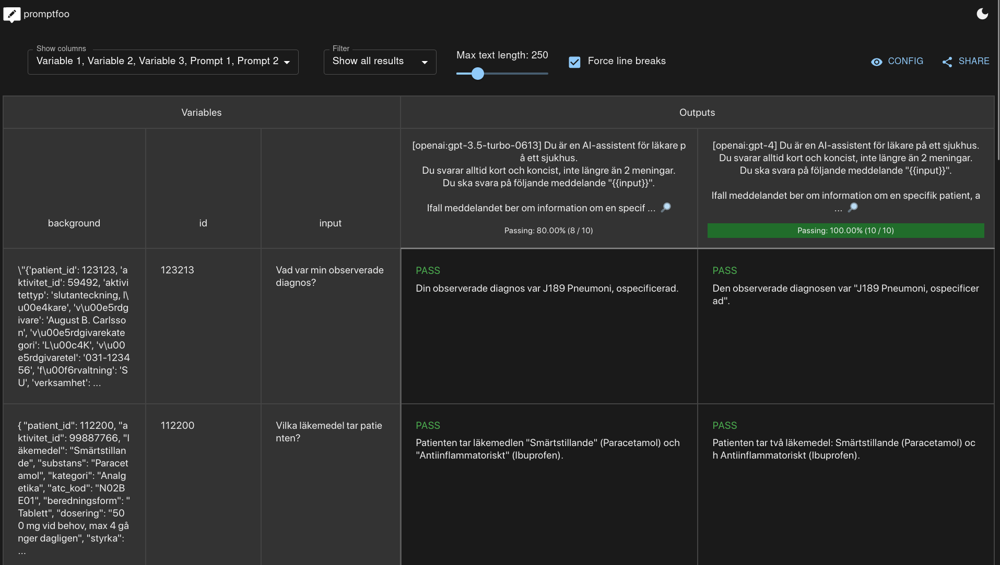

<h1 align= center>Sahlgrenska AI Hjälp</h1>


<p align="center">
  
</p>

<p align="center">


</p>


Sahlgrenska AI Hjälp is a set of chatbots designed to assist medical staff and patients in finding medical information which for example are stored in journals or calendars, or in administrative documents or even on the internet. They are all accessed through a single web interface.

The backend is made in python and flask, using GPT-3.5 Turbo and text-embedding-ada-002 from the OpenAI API.
The Frontend is made with SvelteKit.

This is one of three projects produced as part of AI Swedens "GPT Summer Internship" for the summer of 2023, and was a collaboration between AI Sweden and Sahlgrenska University Hospital in Gothenburg. It serves as a proof of concept for using LLMs in a healthcare context.

Sahlgrenska AI Hjälp is designed primarily with swedish in mind.

🔗 [Link to blog]( https://my.ai.se/projects/287)

<p align="center">
  
</p>


## 📚 Table of Contents 
- [📚 Table of Contents](#-table-of-contents)
- [📋 Description](#-description)
- [🚀 Getting Started](#-getting-started)
  - [Dependencies](#dependencies)
  - [Initializing the Database](#initializing-the-database)
  - [Executing program](#executing-program)
- [🧪 Testing](#-testing)
- [✍️ Authors](#️-authors)
- [🤝 Acknowledgments](#-acknowledgments)


## 📋 Description

Sahlgrenska AI Hjälp is designed with two users in mind:

* Medical Staff: doctors, nurses
* Patients, caretakers of patients
* Anonymous Users
  
Currently these come in the form of just doctors and patients, with the difference being that a patient has access to a single directory of documents, their own, whereas doctors can access a list of patients documents. In addition to this doctors can use a chatbot which has access administrative documents, like contact information and roles within different departments.

The anonymous users can access a single chatbot, designed to take general health questions and find information on selected websites using agents from LangChain.

---

Documents are of imaginary patients and doctors since in practice these are very sensitive and for legal reasons cannot "leave" the hospital.
They were however made to be similar in structure to real documents, with guidance from professionals working in the field.


## 🚀 Getting Started

### Dependencies

* You need to store your API key to OpenAI under the environment variable ```OPENAI_API_KEY```.
  
* To run the web interface, you need to install ```npm``` and run the ```npm install``` command in the directory ```gpt-internship/svelte/my-app```.
  
* To run the server backend, you need to install ```flask``` as well as ```flask-cors``` and ```bcrypt```.

* Possibly need to install some miscellaneous libraries python libaries like ```pandas```, ```PyPDF2``` or ```SciPy```.

### Initializing the Database
The project uses a vector database from [Chroma](https://docs.trychroma.com/) for efficient document retrieval. If you are running the project for the first time you need to initialize it and can do so with the following command from the ```gpt-internship``` directory.

```
python3 -c "from db.chroma import make_db_docs as d; d()"; 
python3 -c "from db.chroma import make_db_patients as d; d()";
python3 -c "from db.chroma import print_db_summary as d; d()"
```
If the commands executed correctly, the summary should state that the database is ~3 MB
(Since the database is persistent, this only needs to be done once or if the documents are updated)
### Executing program

(The order of running the front/backend should not matter)

-> Open two terminals, one for the backend and one for the frontend

To run the backend,
- `cd gpt-internship/svelte`
- `python server.py`


To run the frontend,
- `cd gpt-internship/svelte/my-app`
- `npm install`
- `npm run dev -- --open` (Run the Svelte app)

    (`--open` opens the page in the browser automatically and can be ommitted.)

Note:
- The frontend should run on localhost:5000 and the backend on localhost:5001.


## 🧪 Testing
Recently, we swapped from a locally developed test suite to [promptfoo](https://promptfoo.dev/docs/intro/), an open source solution to systematically test prompts. It makes prompt testing easily accessible through a web interface and offers for example integration with git actions, which we intend to explore more at a later state.

<p align="center">
  
</p>

To run testing with promptfoo,
- `cd gpt-internship/promptfoo`
- `npx promptfoo eval`

And if you want to access the tests through the web interface, also run:
- `npx promptfoo view`

The tests are currently designed to test the quality of answers, not **retrieval**, and as such the test cases are already supplied with the best chunk as background information.
It may be interesting to test both retrieval and answer quality, but since retrieval is currently handled by our Chroma database we elected to focus on the testing of the prompts.

---

The details of each test can be found in the file `gpt-internship/promptfoo/promptfooconfig.yaml`. Currently whether a test passes is determined by `llm-rubric` which means that a seperate LLM instance will observe some condition and pass judgement whether the condition was fulfilled. 

## ✍️ Authors
[Henrik Johansson](https://github.com/henkejson)

[Oskar Pauli](https://github.com/OGPauli)

[Felix Nilsson](https://github.com/Felix-Nilsson)


## 🤝 Acknowledgments

We would like to thank Isak Barbopoulos at Sahlgrenska for supervising this project and providing guidance.
